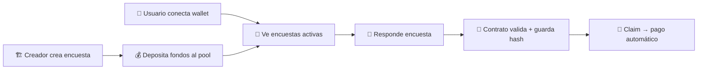
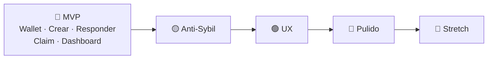
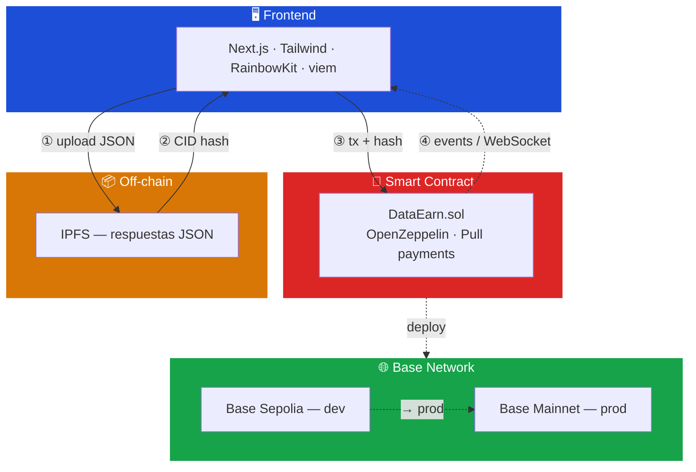

# 💡 Survey Web3 — Project Idea

> **Tagline:** *"Encuestas pagadas 100% on-chain. Conecta tu wallet → responde → cobra al instante."*

---

## 1. 🧠 Idea Principal

**Nombre del Projecto**(no decidido) es una plataforma descentralizada y permissionless de encuestas pagadas desplegada en Base. Cualquiera puede:

- 📋 Crear una encuesta y depositar un pool de recompensas (ETH o USDC).
- 📨 Recibir respuestas reales de usuarios.
- 💸 Los respondedores cobran automáticamente (o con aprobación simple) por responder honestamente.

Todo lo importante — creación, depósito, registro de respuestas y pagos — ocurre en el smart contract. Las respuestas detalladas se guardan en IPFS, pero su integridad queda verificable on-chain.

| | |
|---|---|
| 🔑 **Diferenciador clave** | Primera plataforma de surveys 100% wallet-first (sin email ni login tradicional) con **modo dual Humanos vs Bots** |
| 🎯 **Objetivo** | Quien necesita datos paga y obtiene respuestas rápidas y de calidad; quien responde gana crypto de forma transparente |

---

## 2. 🚀 Core MVP

> Features obligatorias para tener un proyecto funcional y entregable.

- 🔌 **Conexión de wallet** (RainbowKit / ConnectKit) — sin email ni cuentas (no obligatoriamente, puedria tener email de manera alternativa, pero las Tx son todas por blockchain).
- 📝 **Crear encuesta:** título, descripción, preguntas (JSON), recompensa por respuesta, número máximo de respuestas, deadline y depósito de rewards (ETH/USDC).
- 📜 **Lista pública** de encuestas activas (con recompensa visible y respuestas restantes).
- ✅ **Responder encuesta** (solo 1 vez por wallet) → hash de respuestas en IPFS + evento on-chain.
- 🏧 **Claim reward automático** (pull payment) desde el pool.
- 📊 **Dashboard básico del creador** (ver encuestas creadas, respuestas recibidas y retirar fondos sobrantes).

### Flujo end-to-end

---

## 3. 🛡️ Calidad de Datos & Anti-Sybil

- ⏳ **Cooldown de 24 horas** por wallet (evita spam inmediato).
- 🔒 **Hash de respuestas** almacenado en IPFS (imposible modificar o falsificar).
- ✋ **Aprobación manual** opcional por parte del creador (para encuestas de alta recompensa).
- ⭐ **Quality score básico** — reputación on-chain del respondedor según claims exitosos.

### Modo dual al crear encuesta

| Modo | Verificación | Recompensa | Etiqueta |
|------|-------------|------------|----------|
| 🧑 **Humanos** | World ID obligatorio | Alta — datos premium | — |
| 🤖 **Bots / AI** | Sin verificación | Baja — volumen/sintéticos | `AI Generated` |

---

## 4. ✨ UX & Viralidad

- 🐦 **Botón "Share to X"** en cada encuesta (genera tweet con link + recompensa visible).
- 🏷️ **Filtros y categorías** (meme, DeFi, salud, opinión, etc.).
- 📈 **Dashboard del respondedor:** historial de encuestas respondidas y ganancias totales.
- 🏆 **Leaderboard** simple de "Top Earners".
- 🔔 **Notificaciones en tiempo real** (Alchemy WebSockets) cuando alguien responde tu encuesta.
- 📱 Diseño limpio y **mobile-friendly** (Tailwind + Next.js).

---

## 5. ⚙️ Stack Técnico & Seguridad

| Área | Detalle |
|------|---------|
| 🔐 Contratos | OpenZeppelin (`ReentrancyGuard`, `Ownable`, `Pausable`) |
| 📡 Eventos | `SurveyCreated`, `AnswerSubmitted`, `RewardClaimed`, `SurveyClosed` |
| ⛽ Gas | Optimización: `uint256` sparingly, evitar storage innecesario |
| 🌐 Deploy | Base Sepolia (dev) → Base Mainnet (demo final) |
| 🖥️ Frontend | `viem` / `ethers.js` + RainbowKit |
| 📊 Indexing | The Graph o Alchemy Subgraph (opcional) |
| 🧪 Tests | Unitarios e integración con Hardhat |
| 📄 Docs | README completo + documentación de contratos |

---

## 6. 🗺️ Roadmap

### Prioridades por fase

| Fase | Semana | Foco | Estado |
|------|--------|------|--------|
| **1 · MVP** | 1-2 | Wallet, crear, responder, claim, dashboard | 🔴 Obligatorio |
| **2 · Anti-Sybil** | 2-3 | Cooldown, World ID, aprobación manual | 🟡 Importante |
| **3 · UX** | 3 | Share to X, filtros, leaderboard | 🟢 Nice-to-have |
| **4 · Pulido** | 3-4 | Tests, gas, mainnet, docs | 🔵 Cierre |

---

## 7. 🏗️ Arquitectura

