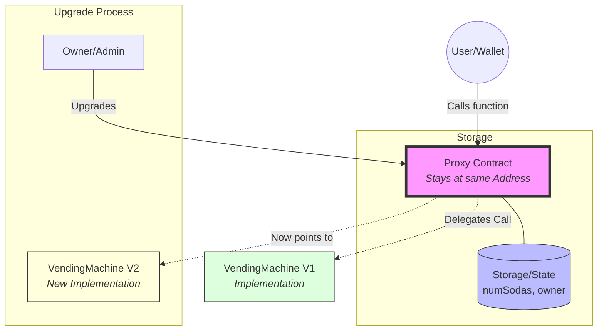

# Week 7: Upgradeable Smart Contracts - Vending Machine

This project demonstrates the **Transparent Proxy Pattern** to allow smart contract upgrades while maintaining state (data) and the same contract address.

## 📊 How it Works (The Visual Process)

In a normal contract, if you want to fix a bug, you have to deploy a new one with a new address. This loses all the data! 

With the **Proxy Pattern**, we use a "Middleman" (The Proxy).

### 🧠 The Core Idea:
1. **The Proxy**: This is what the user talks to. It **never changes**. It holds the **Money (ETH)** and the **Data (Variables)**.
2. **The Implementation (V1/V2)**: These are the "Brains". They contain the code logic.
3. **The Upgrade**: When we upgrade, we just tell the Proxy: *"Hey, instead of using Brain V1, use Brain V2 from now on!"*

---

## 🛠️ Project Summary

### 1. Project Infrastructure
- **Folder**: `week-7-vending-machine`
- **Stack**: Hardhat, OpenZeppelin Upgrades, Ethers.js.

### 2. Smart Contracts
- **VendingMachineV1.sol**: Initial version (soda purchase logic).
- **VendingMachineV2.sol**: Upgraded version (adds owner functions and profit withdrawal).

### 3. Verification Plan
1. Deploy V1 via Proxy.
2. Interact to set state.
3. Upgrade Proxy to point to V2.
4. Verify state is preserved and new functions are available.
